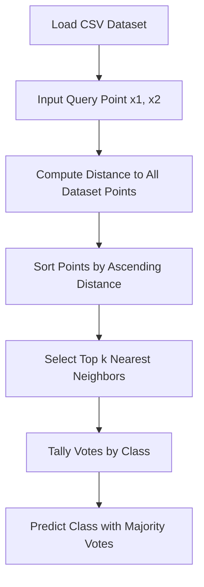

# K-Nearest Neighbors (KNN) Classifier from Scratch in Python

A pure, zero-dependency Python implementation of the **K-Nearest Neighbors (KNN)** classification algorithm from first principles. This repository demonstrates how KNN works under the hood using various distance metrics on the classic Iris dataset.

---

## 📌 Table of Contents

- [Overview](#-overview)
- [Key Features](#-key-features)
- [Modules & Documentation](#-modules--documentation)
- [Distance Metrics Implemented](#-distance-metrics-implemented)
- [Project Structure](#-project-structure)
- [Datasets](#-datasets)
- [Installation & Requirements](#-installation--requirements)
- [Usage & Examples](#-usage--examples)
  - [1. Euclidean Distance (Standard KNN)](#1-euclidean-distance-standard-knn)
  - [2. Manhattan Distance](#2-manhattan-distance)
  - [3. Bray-Curtis Distance](#3-bray-curtis-distance)
  - [4. Jaccard Distance](#4-jaccard-distance)
- [Algorithm Workflow](#-algorithm-workflow)
- [Sample Execution](#-sample-execution)

---

## 📖 Overview

The **K-Nearest Neighbors (KNN)** algorithm is a non-parametric, lazy supervised learning algorithm used for classification and regression. It predicts the class of a target data point based on the majority class among its $k$ closest neighbors in the feature space.

This project implements KNN completely from scratch using standard Python libraries (`csv`, `math`, `pathlib`), without relying on heavy machine learning frameworks such as `scikit-learn` or `numpy`.

---

## ✨ Key Features

- **Zero External Dependencies**: Built entirely using standard Python modules.
- **Multiple Distance Metrics**: Compares various distance formulations (Euclidean, Manhattan, Bray-Curtis, Jaccard).
- **Dedicated Documentation**: Each implementation has an in-depth standalone README explaining mathematics, design, and step-by-step logic.
- **Interactive CLI**: Prompts the user to enter feature values (sepal length, sepal width) and custom $k$ neighbor counts.
- **Transparent Decision Process**: Outputs sorted neighbor distances, vote distributions across classes, and final predicted species.
- **Clean & Modular Code**: Separate executable scripts for each metric for easy comparison and study.

---

## 📚 Modules & Documentation

Detailed per-file documentation is available in the [`docs/`](docs/) directory:

| Python Script | Distance Metric | Dataset Used | Detailed README |
| :--- | :--- | :--- | :--- |
| [`knn.py`](knn.py) | Euclidean ($L_2$ Norm) | [`iris.csv`](iris.csv) | [📄 `docs/knn.md`](docs/knn.md) |
| [`knn_manhattan.py`](knn_manhattan.py) | Manhattan ($L_1$ Norm) | [`iris.csv`](iris.csv) | [📄 `docs/knn_manhattan.md`](docs/knn_manhattan.md) |
| [`knn_bray_curtis.py`](knn_bray_curtis.py) | Bray-Curtis Dissimilarity | [`custom_iris.csv`](custom_iris.csv) | [📄 `docs/knn_bray_curtis.md`](docs/knn_bray_curtis.md) |
| [`knn_jaccard.py`](knn_jaccard.py) | Jaccard (Binarized) | [`iris.csv`](iris.csv) | [📄 `docs/knn_jaccard.md`](docs/knn_jaccard.md) |

---

## 📐 Distance Metrics Implemented

### 1. Euclidean Distance ($L_2$ Norm) &bull; [Read Guide](docs/knn.md)
Measures the straight-line geometric distance between two points:
$$d(p, q) = \sqrt{\sum_{i=1}^{n} (p_i - q_i)^2}$$

### 2. Manhattan Distance ($L_1$ Norm / City Block) &bull; [Read Guide](docs/knn_manhattan.md)
Calculates the sum of absolute differences between coordinates:
$$d(p, q) = \sum_{i=1}^{n} |p_i - q_i|$$

### 3. Bray-Curtis Dissimilarity &bull; [Read Guide](docs/knn_bray_curtis.md)
A normalization metric commonly used in ecology and biology:
$$d(u, v) = \frac{\sum |u_i - v_i|}{\sum |u_i + v_i|}$$

### 4. Jaccard Distance &bull; [Read Guide](docs/knn_jaccard.md)
Measures dissimilarity between binary sample sets (continuous features are binarized using a threshold $\ge 5.0$):
$$d_J(A, B) = 1 - \frac{|A \cap B|}{|A \cup B|}$$

---

## 📁 Project Structure

```text
knn-python/
├── docs/
│   ├── knn.md                  # Detailed docs for knn.py (Euclidean)
│   ├── knn_manhattan.md        # Detailed docs for knn_manhattan.py
│   ├── knn_bray_curtis.md      # Detailed docs for knn_bray_curtis.py
│   └── knn_jaccard.md          # Detailed docs for knn_jaccard.py
├── iris.csv                    # Complete 150-sample Iris dataset
├── custom_iris.csv             # Subset / custom Iris dataset
├── knn.py                      # KNN implementation using Euclidean distance
├── knn_manhattan.py            # KNN implementation using Manhattan distance
├── knn_bray_curtis.py          # KNN implementation using Bray-Curtis distance
├── knn_jaccard.py              # KNN implementation using Jaccard distance (binarized)
└── README.md                   # Main project overview & index
```

---

## 📊 Datasets

- **`iris.csv`**: Contains samples with features `sepal_length`, `sepal_width`, `petal_length`, `petal_width`, and the target class `species` (`setosa`, `versicolor`, `virginica`).
- **`custom_iris.csv`**: A lightweight subset of Iris observations focused on `sepal_length`, `sepal_width`, and `species`.

---

## ⚙️ Installation & Requirements

### Prerequisites
- **Python 3.7+** installed on your system.
- No third-party packages required.

### Setup
Clone or download the repository to your local machine:
```bash
git clone https://github.com/lakshyaraj2006/knn-python.git
cd knn-python
```

---

## 🚀 Usage & Examples

Run any of the scripts directly from the terminal. You will be prompted to enter feature coordinates and $k$.

### 1. Euclidean Distance (Standard KNN)
```bash
python knn.py
```
*See detailed docs in [docs/knn.md](docs/knn.md).*

### 2. Manhattan Distance
```bash
python knn_manhattan.py
```
*See detailed docs in [docs/knn_manhattan.md](docs/knn_manhattan.md).*

### 3. Bray-Curtis Distance
```bash
python knn_bray_curtis.py
```
*See detailed docs in [docs/knn_bray_curtis.md](docs/knn_bray_curtis.md).*

### 4. Jaccard Distance
```bash
python knn_jaccard.py
```
*See detailed docs in [docs/knn_jaccard.md](docs/knn_jaccard.md).*

---

## 🔄 Algorithm Workflow



1. **Load Data**: Parses CSV files using `csv.DictReader` into dictionary records.
2. **Accept Input**: Takes user-defined values for `sepal_length` ($x_1$) and `sepal_width` ($x_2$).
3. **Calculate Distances**: Computes the metric distance between query and each training point.
4. **Sort & Rank**: Sorts candidate records in ascending order based on distance.
5. **Extract $k$ Neighbors**: Retrieves the nearest $k$ elements.
6. **Majority Voting**: Aggregates class frequencies and outputs the class with the highest vote count.

---

## 💻 Sample Execution

```text
$ python knn.py
Enter the data to get predicted species: 
Enter sepal length: 5.2
Enter sepal width: 3.5
Enter the number of nearest neighbors: 3

Nearest neighbors
Distance: 0.10000000000000053, Species: setosa
Distance: 0.14142135623730964, Species: setosa
Distance: 0.22360679774997916, Species: setosa

Votes: {'setosa': 3}

Predicted species: setosa
```
